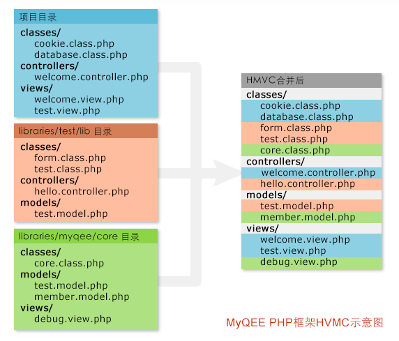

# HMVC

HMVC模式即 `Hierarchical-Model-View-Controller` 模式，也可以叫做 `Layered MVC`．HMVC模式把客户端应用程序分解为有层次的父子关系的MVC。反复应用这个模式，形成结构化的客户端架构。
一个MVC模块由应用程序的一个模块抽象而成。其中很重要的一个概念就是Parent MVC，它可以对应界面上的实体，也可以是一个抽象的对象。设想有一个Windows Form应用程序，有一个框架（frame），此框架由菜单功能模块、导航栏、状态栏、主工作区等部分组成，对应于HMVC，frame MVC 即Layer1 的parent MVC ；菜单MVC、导航栏MVC、状态栏MVC、主工作区 MVC处于第二层（图中只画了一个）。如果你觉得导航栏或主工作区的功能太复杂，也可以再细分成HMVC中的第三层，依次类推，可以扩展到n层，如果你愿意的话。

以上内容来自百度百科 [http://baike.baidu.com/view/3256424.htm](http://baike.baidu.com/view/3256424.htm) 

## MyQEE HMVC 的工作原理

MyQEE的HMVC的原理和文章中描述并不完全相同但是原理是差不多的，那么我们用一张图来解释下MyQEE的HMVC的原理：

我们从这张图来直观的理解一下HMVC的原理，从上图中可以看到图的左边有3种不同的颜色分块，每个分块代表了一个独立的类库，它有自己的MVC分层结构，它们组合后的结果就类似右侧的HMVC的结构。

需要注意的是，**MyQEE并不对类库做物理的合并操作**，而是通过系统逻辑判断，在需要加载某个文件的时候安装HMVC的规则去读取相应的文件从而达到需要的结果。

举个例子，比如程序需要加载 `Model_Member`（即图中的 `member.model.php` 文件），MyQEE会首先从项目目录中寻找是否有这个文件，没有的话则在第三方类库中寻找，最终程序可以在 `Core` 类库中找到这个文件并加载它。

按照以上的规则，那么如果读取 `cookie.class.php` 则会读取“项目目录“的文件，而 `test.model.php` 则会读取 `libraries/test/lib` 的而不是“core“目录的。

这样分层实现MVC的好处就显而易见了：我们可以将独立业务逻辑分在独立的分层里，也可以对底层的相关模块进行扩充、替换等等，而不需要对原有分层的代码进行改动。MyQEE设定了固定的目录优先级，我们不用担心程序会错乱，对于每个项目还可以单独设置加载哪些类库和顺序，这样一切就变得非常的激动人心，你再也不用为一堆文件找不到合适的位置了。

## 熟悉MyQEE系统的各个类库目录结构和优先级

MyQEE系统中将各种用途的类库做了分类，包括：项目，团队类库，第三放类库，核心类库。其中项目和第三方类库都可以有多个。

* 项目目录 - 项目文件存放在 `projects` 目录里，比如 `projects/default/`, `projects/docs/` 等等，项目文件是相互独立的，每个URL请求只可能定位到其中一个上，且具有最好级别的优先级；
* 团队类库 - 团队类库为 `team-library` 目录，这个目录在任何项目执行时都会被调用，它的优先级仅次于项目目录；
* 第三方类库 - 它存放在 `libraries` 目录中，如果没有特别设置，系统默认是不会加载任何第三方类库的，它的优先级低于团队类库；
* 核心类库 - 即 `core` 目录，它是MyQEE的核心部分，和团队类库一样会被任何请求加载，并且它的优先级是最低的；

## 如何设置以达到需要的HMVC组合

既然每个类库都有自己的优先级，特别是第三方类库，需要程序中设定好才会被加载，那么如何设置呢？

打开根目录的 `config.php` (不存在则把 `config.new.php` 复制为 `config.php`)，可以看到最上面的 `$config['projects']` 相关设置，是的，所有需要加载的类库都会在这个里面定义；

    $config['projects'] = array
    (
        // 请确保Default放在最后
        'default' => array
        (
            'name'      => '默认项目',        //名称
            'dir'       => 'default',        //目录
            'isuse'     => true,             //是否启用
            'url'       => '/',              //URL根目录，可以是字符串也可以是数组，可以/开头，也可以http://开头。
            'url_admin' => '/admin/',        //后台URL根目录，同上
            /*
            // 此项目有的加载类库配置
            'libraries' => array
            (
                'autoload' => array(),
                'cli'      => array(),
                'debug'    => array(),
                'admin'    => array(),
            ),
            */
        ),
    );
    
你会看到 `libraries` 的相关设置被注释掉了，是的，如果你需要给某人项目默认加载某个类库，直接按这个格式填写即可。

再往下看，会看到 `$config['libraries']` 的设置：

    $config['libraries'] = array
    (
        // 默认会自动加载的类库
        'autoload' => array
        (
    
        ),
    
        // 命令行下会加载的类库
        'cli'      => array
        (
    
        ),
    
        // 调试环境下会加载的类库
        'debug'    => array
        (
            'com.myqee.develop',
        ),
    
        // 后台会加载的类库
        'admin'    => array
        (
            'com.myqee.administration',
        ),
    );

它设设置所有项目的类库加载的，其中有4个模式，分别是：

* autoload - 任何时候都会被自动加载的类库
* cli      - 在处于命令行运行时会加载的类库
* debug    - 当开启了本地调试模式或者开启了远程调试模式时会加载的类库
* admin    - 请求为后台模式时会加载的类库

比如说debug设置了 `com.myqee.develop` 表示当程序开启调试模式时它会加载 `libraries/myqee/develop/` 目录的类库；而admin设置了 `com.myqee.administration` 表示后台URL请求时都会加载 `libraries/myqee/administration/` 目录的类库。

